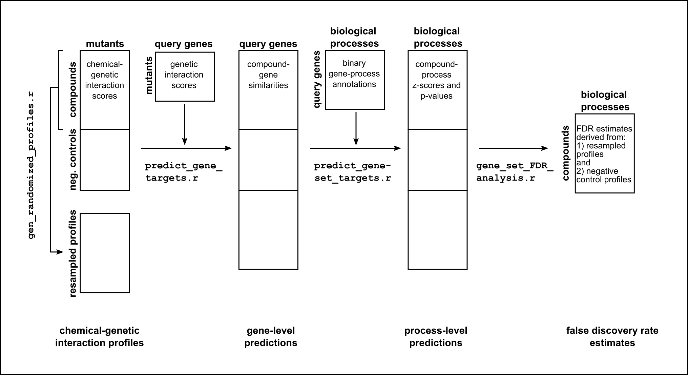

# **CG-TARGET**

CG-TARGET is a collection of R scripts to be used for the purpose of predicting gene-set targets from chemical-genetic interaction profiles.

## Features

- Interprets chemical-genetic interaction profiles using a reference set of genetic interaction networks.
- Species-independent: any species with chemical-genetic interaction profiles can be intepreted, as long as an appropriate genetic interaction dataset is available.
- Genetic interaction datasets and gene set annotations are automatically downloaded. (users can supply their own GI datasets and gene sets as well)
- Scalable: amenable to the analysis of both small and large chemical-genetic interaction datasets.
- Written in R; no other dependencies.

## How to use

After downloading the software and setting up your environment variables, it is quite simple to run the commands. First, you will need to set up your configuration file (here called `config_file.yaml`). The `example_config_file.yaml` is provided as a template in the main folder.

### General overview

Given the following datasets, CG-TARGET predicts the biological processes (or other functionally coherent gene sets) that are perturbed by compounds:
1. A dataset of chemical-genetic interaction profiles obtained for compounds and negative controls (typically a solvent control such as DMSO) against a mutant collection
2. A dataset of genetic interaction profiles obtained for "query" gene mutants against a mutant collection that overlaps with the profiles in (1)
3. A collection of biological process (or other gene set) annotations for the query genes in (2)



CG-TARGET can be broken down into four distinct steps:

1. `gen_randomized_profiles.r` generates randomly-resampled profiles, which are used in z-score/p-value and FDR calculations, from compound-treated conditions.
2. `predict_gene_targets.r` integrates the chemical-genetic and genetic interaction profiles to generate a similarity score for each combination of compound and genetic interaction query gene.
3. `predict_gene_set_targets.r` aggregates these compound-gene similarity scores at the level of biological processes (or other gene sets) to generate z-scores and p-values for each compound-process association.
3. `gene_set_FDR_analysis.r` uses the process-level predictions derived from negative control and resampled chemical-genetic interaction profiles to calculate estimates of the false discovery rate.

### Script details

Note: config_file.yaml defines a folder that contains the output of all scripts, called `output_folder`. This is referenced below as `<output_folder>`.

#### 1. View available genetic interaction datasets

```bash
gi_datasets.r
```

Use this script to check which genetic interaction datasets are available.

#### 2. View available gene sets

```bash
gene_sets.r
```

Use this script to check which gene set annotations are available.

#### 3. Generate resampled profiles

```bash
gen_randomized_profiles.r config_file.yaml
```

This script generates the set of resampled profiles derived from compound-treated conditions. Output is in `<output_folder>/resampled_profiles/`. This step is unnecessary if `per-array_resampling_scheme` or `num_per-array_resampled_profiles` is set to `0` in the config file.

#### 4. Predict gene targets for both the real and resampled profiles

```bash
predict_gene_targets.r config_file.yaml
predict_gene_targets.r --rand config_file.yaml
```

This script generates compound-gene similarity scores by integrating chemical-genetic and genetic interaction profiles. Output is in `<output_folder>/gene_target_prediction/`. Without the `--rand` flag, the computations are performed for the compound-treated and negative control profiles, and with the `--rand` flag, they are performed for the resampled profiles.

#### **Optional:** Create a clustered heat map of gene target prediction scores

This will be a *.CDT file, viewable with [Java TreeView](http://jtreeview.sourceforge.net). You can choose to view the predictions for the resampled profiles too (again, using `--rand`).

```bash
visualize_gene_targets.r config_file.yaml
visualize_gene_targets.r --rand config_file.yaml
```

#### 5. Predict the gene-set targets

```bash
predict_gene-set_targets.r config_file.yaml
```

This script aggregates compound-gene similarity scores into z-scores and p-values for each combination of compound and biological process. Output is in `<output_folder>/gene_set_target_prediction/`.

#### 6. Estimate false discovery rate and export final gene-set target prediction tables.

```bash
gene_set_FDR_analysis.r config_file.yaml
```

This script compares the rate of prediction for compounds versus 1) negative control profiles and 2) resampled profiles across the full range of p-values, resulting in empirical estimates of the false discovery rate. Output is in `<output_folder>/final_results/`. If `FDR_estimation_scheme` is set to 2 in the config file, no figures are generated.

## Installation

### 1. Requirements

This software is written in R, and thus requires a working R installation. R compiled with BLAS support (or linked to an optimized BLAS library such as Intel(c) MKL, OpenBLAS, etc) is recommended as speed at which some steps finish depends highly on the speed of the matrix multiplications involved.

__**The following libraries are required:**__

	data.table
	digest
	ggplot2
	grid
	gridExtra
	optparse
	reshape2
	tools
	yaml
	
__**The following system commands are required:**__

	gzip (the function of `gzip -dc` must be to decompress a gzipped file and print to stdout)

__**The following libraries are optional:**__

(they are only required for the `visualize_gene_targets.r` script, which is optional)

	ctc
	fastcluster

_**Note**: Packages `grid` and `tools` might give a "cannot upgrade" message because they are part of base R packages. `ctc` is [from Bioconductor](https://www.bioconductor.org/packages/release/bioc/html/ctc.html)_

### 2. Downloading CG-TARGET

#### Basic

Head on over to https://github.com/csbio/CG-TARGET/releases/ and download the latest release. Extract the compressed folder to a good location from which to run the software (i.e. get it out of your downloads folder!)

#### Advanced

If you know what you are doing and want to keep up-to-date with the latest version, clone the repository (`git clone https://github.com/csbio/CG-TARGET.git` or windows equivalent).


### 3. Setting up environment variables

Required: **TARGET_PATH**

Set the value of this environment variable to the path of the CG-TARGET folder you downloaded and extracted. The scripts from [BEAN-counter](https://www.nature.com/articles/s41596-018-0099-1) will look for this variable in your environment, so it must be set.

Optional, but strongly recommended: adding `$TARGET_PATH/scripts/` to your PATH

Adding the scripts folder inside of the CG-TARGET folder to your **PATH** environment variable allows you to execute the commands in the pipeline by calling them only by their names (all demos will assume this has been done).

### FAQ
#### 1. How do I set my environment variables?

##### Linux/Mac
The best way to do this is by adding code to the scripts that run every time you open a new shell. If you use the bash shell, then add the following line to either your ~/.bashrc or ~/.bash_profile files:

```bash
export TARGET_PATH=/your/path/to/CG-TARGET/
```

If you use the c shell (csh), then add the following line to your ~/.cshrc file:

```shell
setenv TARGET_PATH /your/path/to/CG-TARGET/
```

(but please, **please** do us all a favor and ditch the c shell already)

To append a directory to your PATH variable, add this line to your `~/.bashrc` or `~/.bash_profile` (or equivalent for `~/.cshrc`):

```bash
export PATH=$PATH:/your/path/to/CG-TARGET/scripts
```

##### Windows

[Tutorial for changing path variables](http://www.computerhope.com/issues/ch000549.htm)

<!--
##### Environments

I am an advocate of using virtual environments to manage environment variables in ways that keep one's default environment clean from the many different variables that may be required for different software packages. I currently use anaconda, a combined virtual environment and package manager, to manage my Microsoft R Open and GNU R installations. Venv is another good virtual environment manager.

For an example of how I set up R using conda, see this gist: https://gist.github.com/RussianImperialScott/d10a83366ee8bc2823fa63651cb65fe3
-->

#### 2. How do I compile R with BLAS or install other BLAS libraries?
There are tutorials on the internet on how to compile R with BLAS enabled. Unfortunately, YMMV depending on the version of R you are compiling, your OS as well as the strength of your coffee. Compiling or installing other BLAS libraries is somewhat easier.  
Linking the two libraries is as simple as `ln -s /path/to/BLASlibrary /path/to/R/installation/lib/libRblas.so`

#### 3. Ok, I compiled R with BLAS and linked the library. How do I check if R is using the correct BLAS library?

1. Run the R executable

2. Find the process ID for that executable using `ps` or `top` etc.
```bash
ps aux | grep '/opt/R'
```

3. use `lsof` to **l**i**s**t the **o**pen **f**iles being used by the process ID from step 2.
```bash
lsof -p <pid> | grep 'blas'
```

There are other ways to do this such as using the command `sessionInfo()` from within your R session.

## License

Use of this code is free for academic use and for a 60-day commercial trial period. Sustained commercial use requires the purchase of a license.

In any case, please head on over to z.umn.edu/cgtarget to register for a license. This helps me keep track of the user base :)
